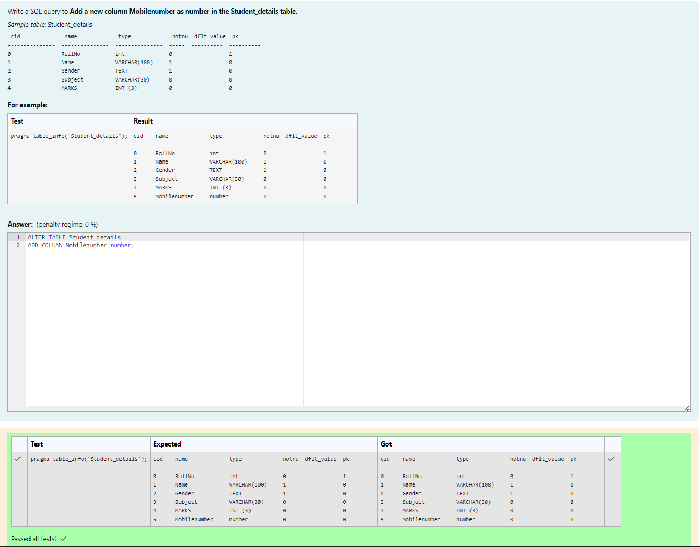
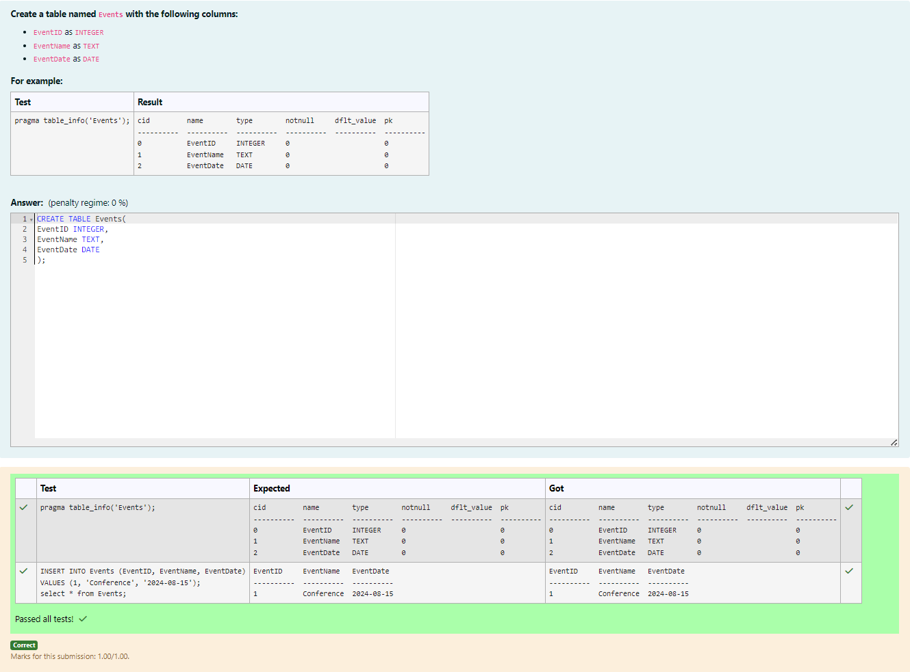
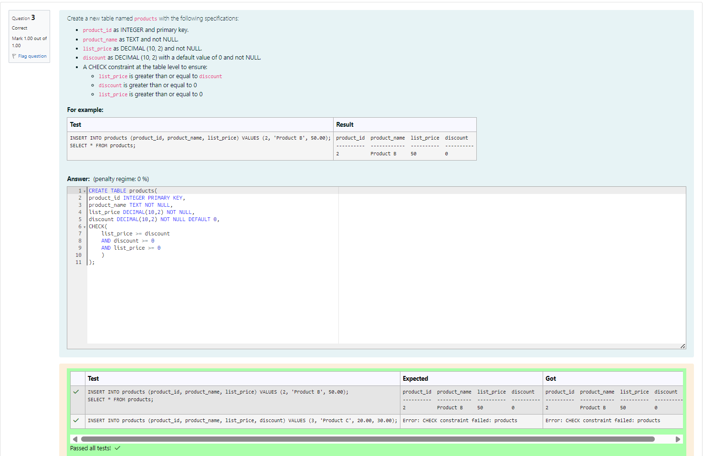
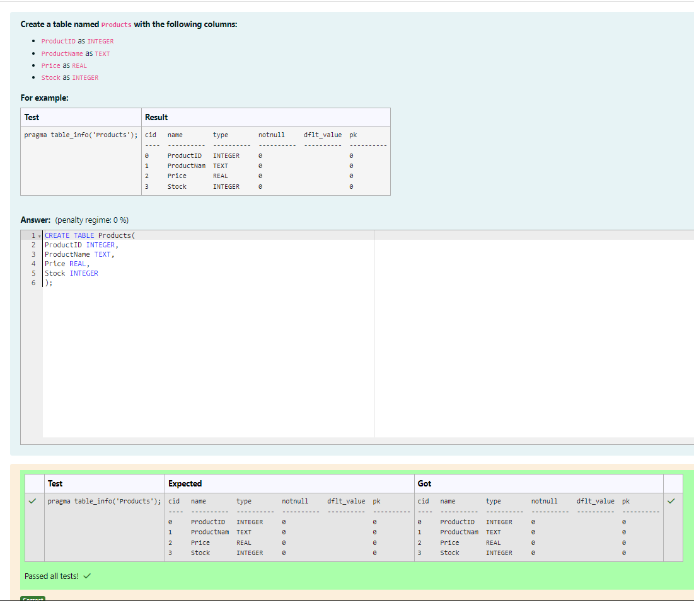
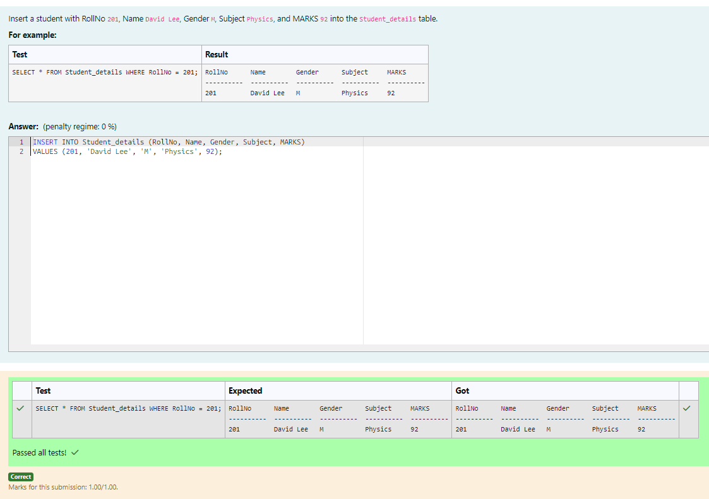
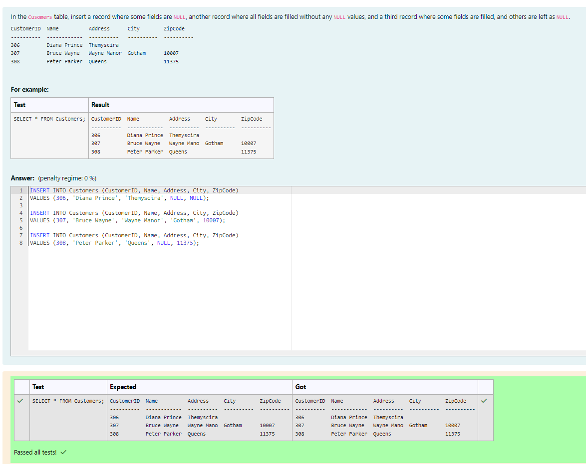
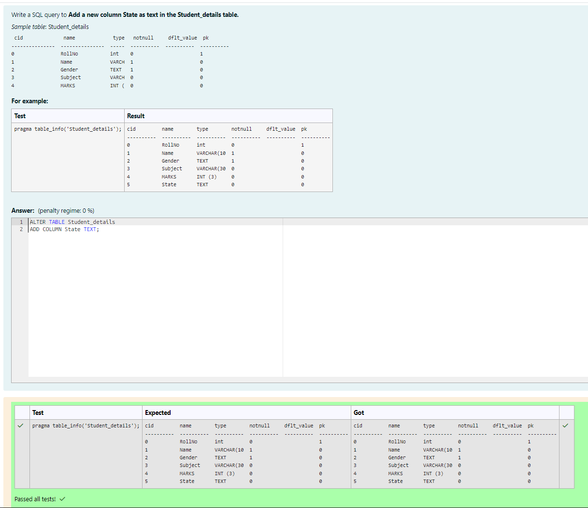
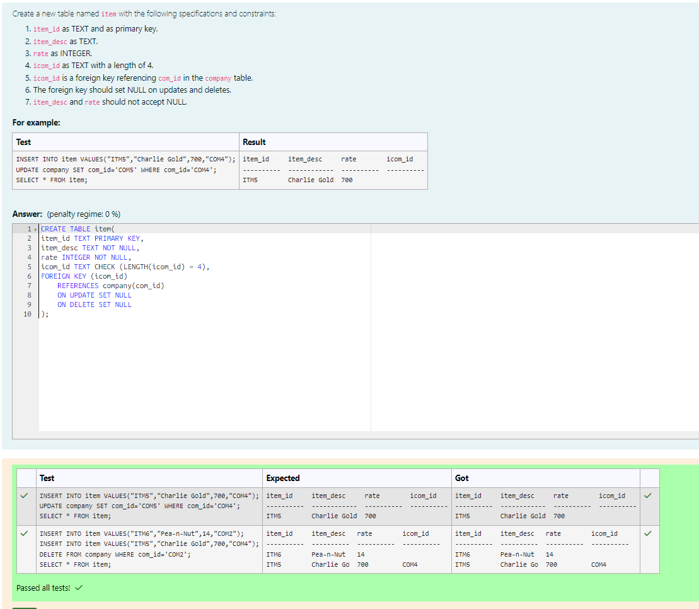
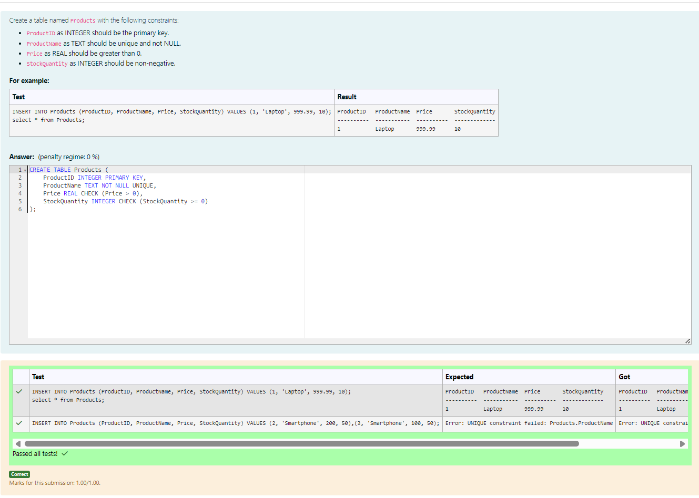
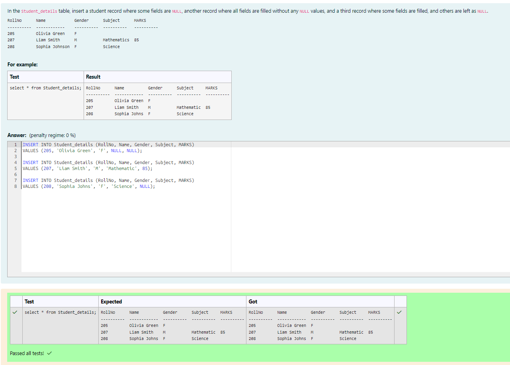

# Experiment 2: DDL Commands

## AIM
To study and implement DDL commands and different types of constraints.

## THEORY

### 1. CREATE
Used to create a new relation (table).

**Syntax:**
```sql
CREATE TABLE (
  field_1 data_type(size),
  field_2 data_type(size),
  ...
);
```
### 2. ALTER
Used to add, modify, drop, or rename fields in an existing relation.
(a) ADD
```sql
ALTER TABLE std ADD (Address CHAR(10));
```
(b) MODIFY
```sql
ALTER TABLE relation_name MODIFY (field_1 new_data_type(size));
```
(c) DROP
```sql
ALTER TABLE relation_name DROP COLUMN field_name;
```
(d) RENAME
```sql
ALTER TABLE relation_name RENAME COLUMN old_field_name TO new_field_name;
```
### 3. DROP TABLE
Used to permanently delete the structure and data of a table.
```sql
DROP TABLE relation_name;
```
### 4. RENAME
Used to rename an existing database object.
```sql
RENAME TABLE old_relation_name TO new_relation_name;
```
### CONSTRAINTS
Constraints are used to specify rules for the data in a table. If there is any violation between the constraint and the data action, the action is aborted by the constraint. It can be specified when the table is created (using CREATE TABLE) or after it is created (using ALTER TABLE).
### 1. NOT NULL
When a column is defined as NOT NULL, it becomes mandatory to enter a value in that column.
Syntax:
```sql
CREATE TABLE Table_Name (
  column_name data_type(size) NOT NULL
);
```
### 2. UNIQUE
Ensures that values in a column are unique.
Syntax:
```sql
CREATE TABLE Table_Name (
  column_name data_type(size) UNIQUE
);
```
### 3. CHECK
Specifies a condition that each row must satisfy.
Syntax:
```sql
CREATE TABLE Table_Name (
  column_name data_type(size) CHECK (logical_expression)
);
```
### 4. PRIMARY KEY
Used to uniquely identify each record in a table.
Properties:
Must contain unique values.
Cannot be null.
Should contain minimal fields.
Syntax:
```sql
CREATE TABLE Table_Name (
  column_name data_type(size) PRIMARY KEY
);
```
### 5. FOREIGN KEY
Used to reference the primary key of another table.
Syntax:
```sql
CREATE TABLE Table_Name (
  column_name data_type(size),
  FOREIGN KEY (column_name) REFERENCES other_table(column)
);
```
### 6. DEFAULT
Used to insert a default value into a column if no value is specified.

Syntax:
```sql
CREATE TABLE Table_Name (
  col_name1 data_type,
  col_name2 data_type,
  col_name3 data_type DEFAULT 'default_value'
);
```

**Question 1**
--
Write a SQL query to Add a new column Mobilenumber as number in the Student_details table.

```
Sample table: Student_details

 cid              name             type             notnu  dflt_value  pk
---------------  ---------------  ---------------  -----  ----------  ----------
0                RollNo           int              0                  1
1                Name             VARCHAR(100)     1                  0
2                Gender           TEXT             1                  0
3                Subject          VARCHAR(30)      0                  0
4                MARKS            INT (3)          0                  0
```

```sql 
ALTER TABLE Student_details
ADD COLUMN Mobilenumber number;
```

**Output:**



**Question 2**
---
Create a table named Events with the following columns:
EventID as INTEGER
EventName as TEXT
EventDate as DATE

```sql
CREATE TABLE Events(
EventID INTEGER,
EventName TEXT,
EventDate DATE
);
```

**Output:**



**Question 3**
---
Create a new table named products with the following specifications:
product_id as INTEGER and primary key.
product_name as TEXT and not NULL.
list_price as DECIMAL (10, 2) and not NULL.
discount as DECIMAL (10, 2) with a default value of 0 and not NULL.
A CHECK constraint at the table level to ensure:
list_price is greater than or equal to discount
discount is greater than or equal to 0
list_price is greater than or equal to 0

```sql
CREATE TABLE products(
product_id INTEGER PRIMARY KEY,
product_name TEXT NOT NULL,
list_price DECIMAL(10,2) NOT NULL,
discount DECIMAL(10,2) NOT NULL DEFAULT 0,
CHECK(
    list_price >= discount
    AND discount >= 0
    AND list_price >= 0
    )
);
```

**Output:**



**Question 4**
---
Create a table named Products with the following columns:
ProductID as INTEGER
ProductName as TEXT
Price as REAL
Stock as INTEGER

```sql
CREATE TABLE Products(
ProductID INTEGER,
ProductName TEXT,
Price REAL,
Stock INTEGER
);
```

**Output:**



**Question 5**
---
Insert a student with RollNo 201, Name David Lee, Gender M, Subject Physics, and MARKS 92 into the Student_details table.

```sql
INSERT INTO Student_details (RollNo, Name, Gender, Subject, MARKS)
VALUES (201, 'David Lee', 'M', 'Physics', 92);
```

**Output:**



**Question 6**
---
In the Cusomers table, insert a record where some fields are NULL, another record where all fields are filled without any NULL values, and a third record where some fields are filled, and others are left as NULL.

```
CustomerID  Name          Address      City        ZipCode
----------  ------------  ----------   ----------  ----------
306         Diana Prince  Themyscira
307         Bruce Wayne   Wayne Manor  Gotham      10007
308         Peter Parker  Queens                   11375
```

```sql
INSERT INTO Customers (CustomerID, Name, Address, City, ZipCode)
VALUES (306, 'Diana Prince', 'Themyscira', NULL, NULL);

INSERT INTO Customers (CustomerID, Name, Address, City, ZipCode)
VALUES (307, 'Bruce Wayne', 'Wayne Manor', 'Gotham', 10007);

INSERT INTO Customers (CustomerID, Name, Address, City, ZipCode)
VALUES (308, 'Peter Parker', 'Queens', NULL, 11375);
```

**Output:**



**Question 7**
---

Write a SQL query to Add a new column State as text in the Student_details table.

```
Sample table: Student_details

 cid              name             type   notnull     dflt_value  pk
---------------  ---------------  -----  ----------  ----------  ----------
0                RollNo           int    0                       1
1                Name             VARCH  1                       0
2                Gender           TEXT   1                       0
3                Subject          VARCH  0                       0
4                MARKS            INT (3)  0                       0
```

```sql
ALTER TABLE Student_details
ADD COLUMN State TEXT;
```

**Output:**



**Question 8**
---
Create a new table named item with the following specifications and constraints:
item_id as TEXT and as primary key.
item_desc as TEXT.
rate as INTEGER.
icom_id as TEXT with a length of 4.
icom_id is a foreign key referencing com_id in the company table.
The foreign key should set NULL on updates and deletes.
item_desc and rate should not accept NULL.

```sql
CREATE TABLE item(
item_id TEXT PRIMARY KEY,
item_desc TEXT NOT NULL,
rate INTEGER NOT NULL,
icom_id TEXT CHECK (LENGTH(icom_id) = 4),
FOREIGN KEY (icom_id)
    REFERENCES company(com_id)
    ON UPDATE SET NULL
    ON DELETE SET NULL
);
```

**Output:**



**Question 9**
---
Create a table named Products with the following constraints:
ProductID as INTEGER should be the primary key.
ProductName as TEXT should be unique and not NULL.
Price as REAL should be greater than 0.
StockQuantity as INTEGER should be non-negative.

```sql
CREATE TABLE Products (
    ProductID INTEGER PRIMARY KEY,
    ProductName TEXT NOT NULL UNIQUE,
    Price REAL CHECK (Price > 0),
    StockQuantity INTEGER CHECK (StockQuantity >= 0)
);
```

**Output:**



**Question 10**
---
In the Student_details table, insert a student record where some fields are NULL, another record where all fields are filled without any NULL values, and a third record where some fields are filled, and others are left as NULL.

```
RollNo      Name            Gender      Subject      MARKS
----------  ------------    ----------  ----------   ----------
205         Olivia Green    F
207         Liam Smith      M           Mathematics  85
208         Sophia Johnson  F           Science
```

```sql
INSERT INTO Student_details (RollNo, Name, Gender, Subject, MARKS)
VALUES (205, 'Olivia Green', 'F', NULL, NULL);

INSERT INTO Student_details (RollNo, Name, Gender, Subject, MARKS)
VALUES (207, 'Liam Smith', 'M', 'Mathematic', 85);

INSERT INTO Student_details (RollNo, Name, Gender, Subject, MARKS)
VALUES (208, 'Sophia Johns', 'F', 'Science', NULL);
```

**Output:**



## RESULT
Thus, the SQL queries to implement different types of constraints and DDL commands have been executed successfully.
