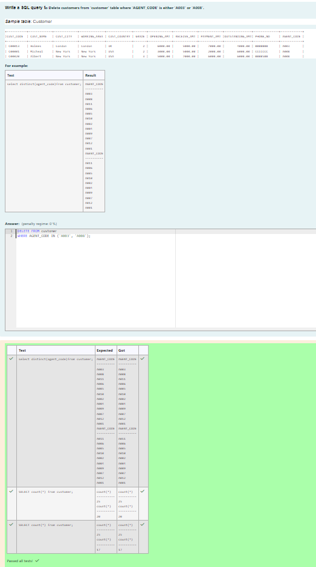
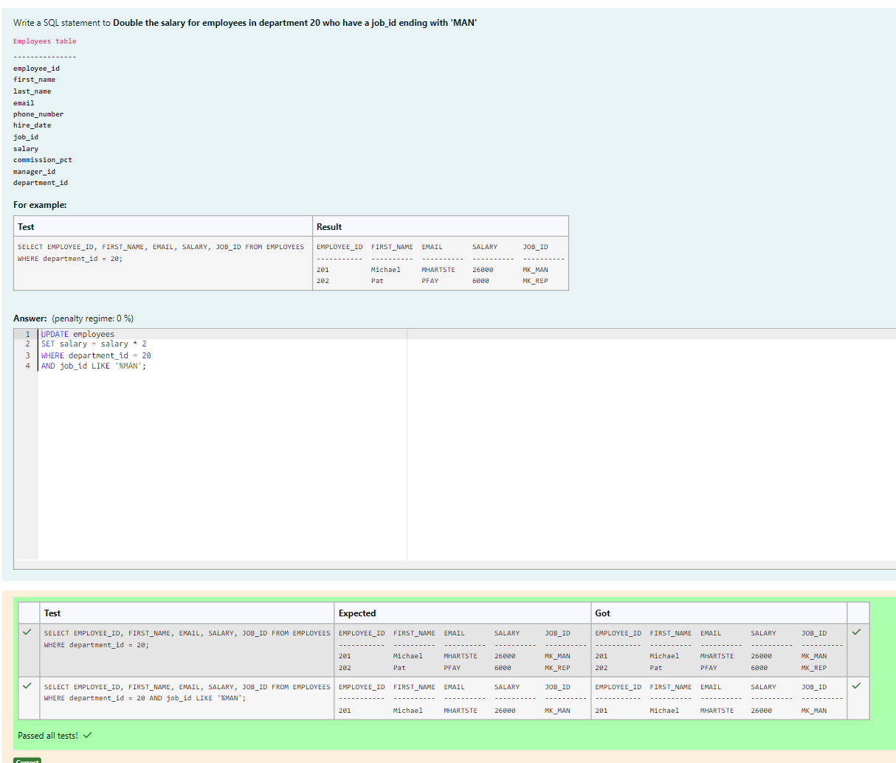
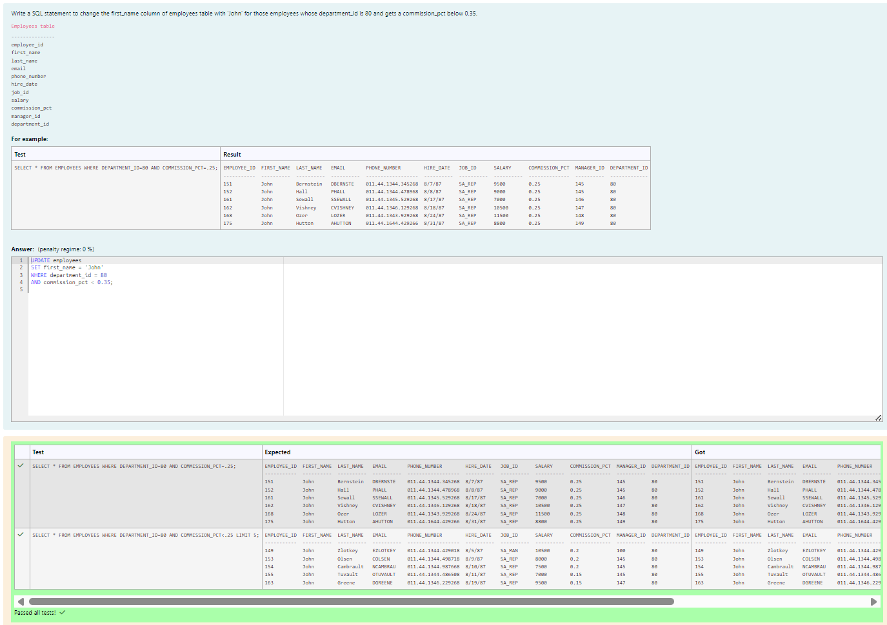
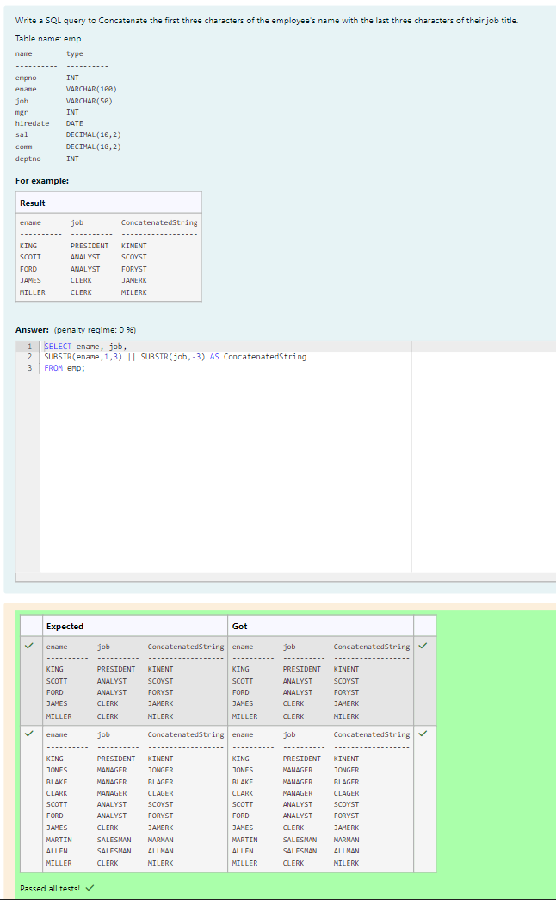
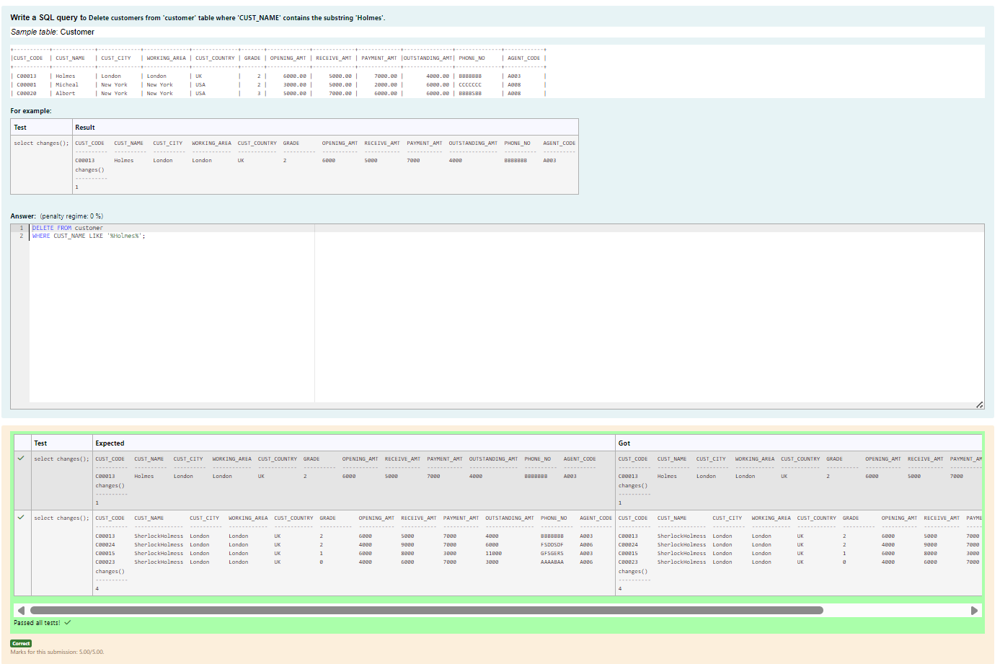
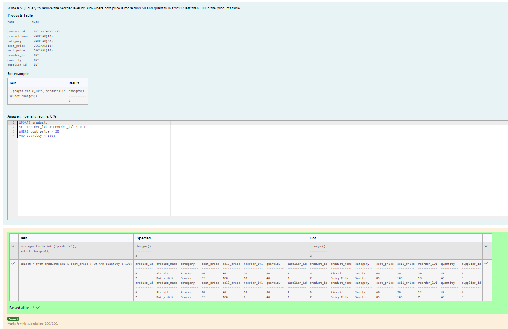
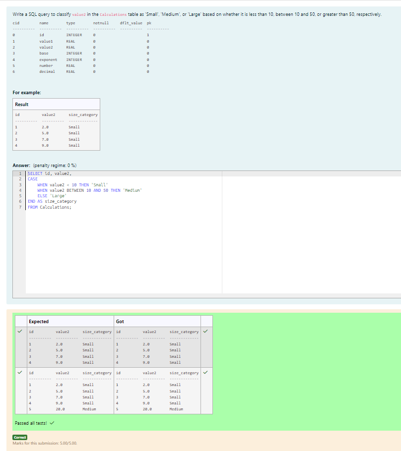
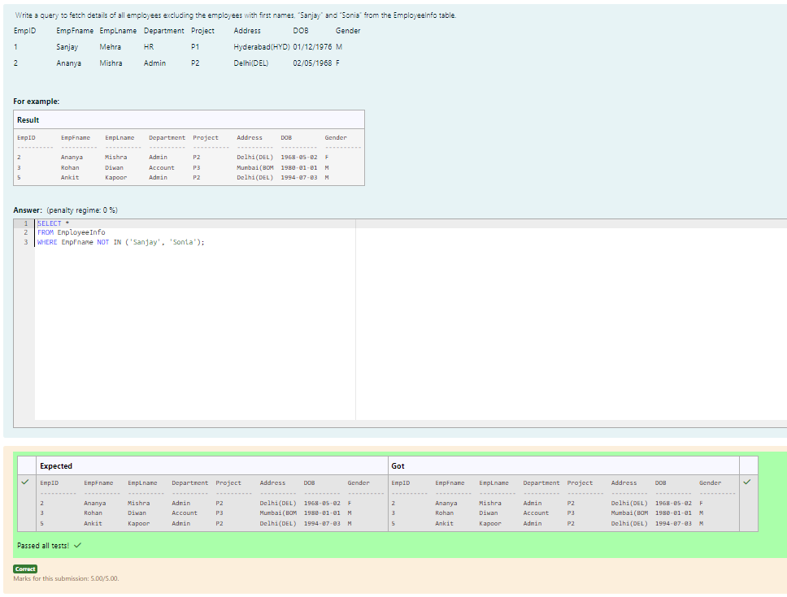
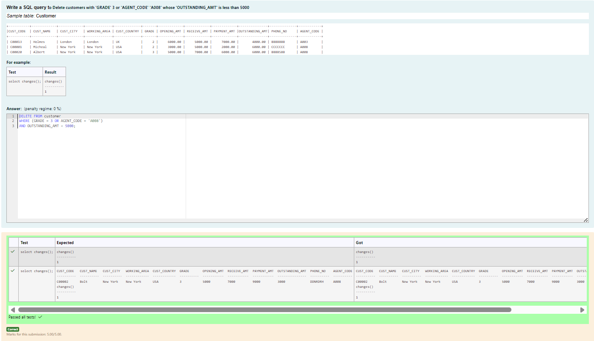
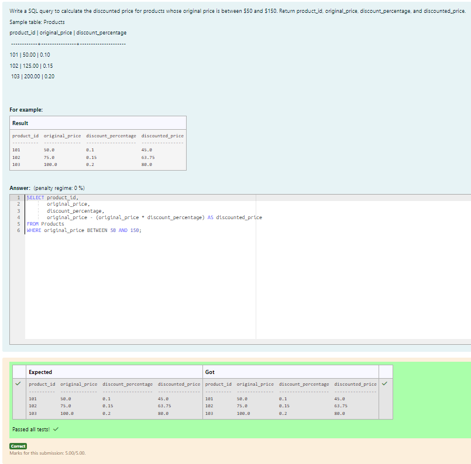

# Experiment 3: DML Commands

## AIM
To study and implement DML (Data Manipulation Language) commands.

## THEORY

### 1. INSERT INTO
Used to add records into a relation.
These are three type of INSERT INTO queries which are as
A)Inserting a single record
**Syntax (Single Row):**
```sql
INSERT INTO table_name (field_1, field_2, ...) VALUES (value_1, value_2, ...);
```
**Syntax (Multiple Rows):**
```sql
INSERT INTO table_name (field_1, field_2, ...) VALUES
(value_1, value_2, ...),
(value_3, value_4, ...);
```
**Syntax (Insert from another table):**
```sql
INSERT INTO table_name SELECT * FROM other_table WHERE condition;
```
### 2. UPDATE
Used to modify records in a relation.
Syntax:
```sql
UPDATE table_name SET column1 = value1, column2 = value2 WHERE condition;
```
### 3. DELETE
Used to delete records from a relation.
**Syntax (All rows):**
```sql
DELETE FROM table_name;
```
**Syntax (Specific condition):**
```sql
DELETE FROM table_name WHERE condition;
```
### 4. SELECT
Used to retrieve records from a table.
**Syntax:**
```sql
SELECT column1, column2 FROM table_name WHERE condition;
```

**Question 1**
--
Write a SQL query to Delete customers from 'customer' table where 'AGENT_CODE' is either 'A003' or 'A008'.

```sql
DELETE FROM customer
WHERE AGENT_CODE IN ('A003', 'A008');
```

**Output:**



**Question 2**
---
Write a SQL statement to Double the salary for employees in department 20 who have a job_id ending with 'MAN'
```
Employees table

---------------
employee_id
first_name
last_name
email
phone_number
hire_date
job_id
salary
commission_pct
manager_id
department_id 
```

```sql
UPDATE employees
SET salary = salary * 2
WHERE department_id = 20
AND job_id LIKE '%MAN';
```

**Output:**



**Question 3**
---
Write a SQL statement to change the first_name column of employees table with 'John' for those employees whose department_id is 80 and gets a commission_pct below 0.35.
```
Employees table

---------------
employee_id
first_name
last_name
email
phone_number
hire_date
job_id
salary
commission_pct
manager_id
department_id 
```

```sql
UPDATE employees
SET first_name = 'John'
WHERE department_id = 80
AND commission_pct < 0.35;
```

**Output:**



**Question 4**
---
Write a SQL query to Concatenate the first three characters of the employee's name with the last three characters of their job title.
```
Table name: emp

name        type
----------  ----------
empno       INT
ename       VARCHAR(100)
job         VARCHAR(50)
mgr         INT
hiredate    DATE
sal         DECIMAL(10,2)
comm        DECIMAL(10,2)
deptno      INT
```

```sql
SELECT ename, job,
SUBSTR(ename,1,3) || SUBSTR(job,-3) AS ConcatenatedString
FROM emp;
```

**Output:**



**Question 5**
---
Write a SQL query to Delete customers from 'customer' table where 'CUST_NAME' contains the substring 'Holmes'.

```sql
DELETE FROM customer
WHERE CUST_NAME LIKE '%Holmes%';
```

**Output:**



**Question 6**
---
Write a SQL query to reduce the reorder level by 30% where cost price is more than 50 and quantity in stock is less than 100 in the products table.
```
Products Table 

name          type       
----------    ---------- 
product_id     INT PRIMARY KEY        
product_name   VARCHAR(10) 
category       VARCHAR(50) 
cost_price     DECIMAL(10) 
sell_price     DECIMAL(10) 
reorder_lvl    INT        
quantity       INT        
supplier_id    INT   
```

```sql
UPDATE products
SET reorder_lvl = reorder_lvl * 0.7
WHERE cost_price > 50
AND quantity < 100;
```

**Output:**



**Question 7**
---
Write a SQL query to classify value2 in the Calculations table as 'Small', 'Medium', or 'Large' based on whether it is less than 10, between 10 and 50, or greater than 50, respectively.
```
cid         name        type        notnull     dflt_value  pk
----------  ----------  ----------  ----------  ----------  ----------
0           id          INTEGER     0                       1
1           value1      REAL        0                       0
2           value2      REAL        0                       0
3           base        INTEGER     0                       0
4           exponent    INTEGER     0                       0
5           number      REAL        0                       0
6           decimal     REAL        0                       0
``` 

```sql
SELECT id, value2,
CASE
    WHEN value2 < 10 THEN 'Small'
    WHEN value2 BETWEEN 10 AND 50 THEN 'Medium'
    ELSE 'Large'
END AS size_category
FROM Calculations;
```

**Output:**



**Question 8**
---
 Write a query to fetch details of all employees excluding the employees with first names, “Sanjay” and “Sonia” from the EmployeeInfo table.

```sql
SELECT *
FROM EmployeeInfo
WHERE EmpFname NOT IN ('Sanjay', 'Sonia');
```

**Output:**



**Question 9**
---
Write a SQL query to Delete customers with 'GRADE' 3 or 'AGENT_CODE' 'A008' whose 'OUTSTANDING_AMT' is less than 5000

```sql
DELETE FROM customer
WHERE (GRADE = 3 OR AGENT_CODE = 'A008')
AND OUTSTANDING_AMT < 5000;
```

**Output:**



**Question 10**
---
Write a SQL query to calculate the discounted price for products whose original price is between $50 and $150. Return product_id, original_price, discount_percentage, and discounted_price.
```
Sample table: Products

product_id | original_price | discount_percentage

 ------------+----------------+--------------------- 

101 | 50.00 | 0.10 

102 | 125.00 | 0.15

 103 | 200.00 | 0.20
```

```sql
SELECT product_id,
       original_price,
       discount_percentage,
       original_price - (original_price * discount_percentage) AS discounted_price
FROM Products
WHERE original_price BETWEEN 50 AND 150;
```

**Output:**



## RESULT
Thus, the SQL queries to implement DML commands have been executed successfully.
