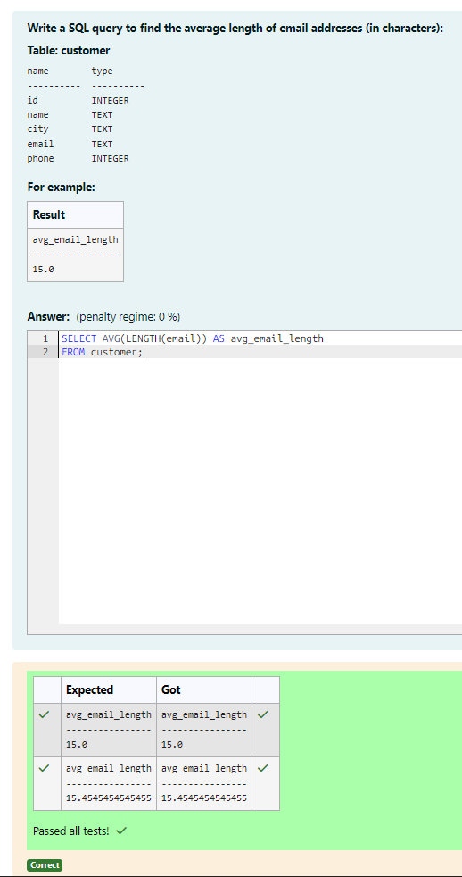
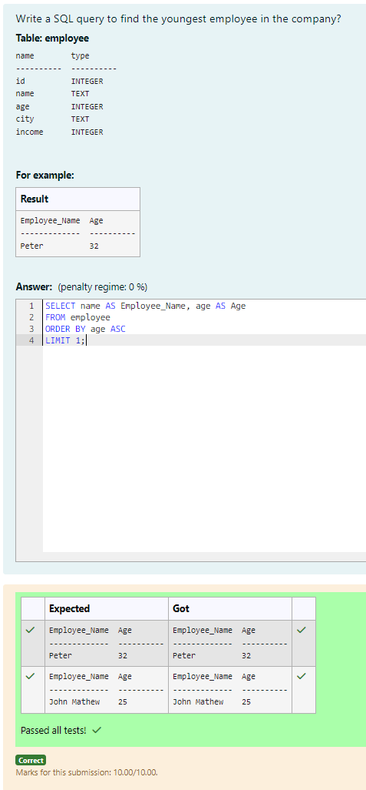
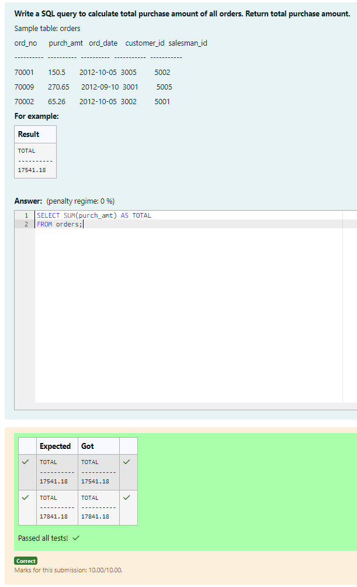
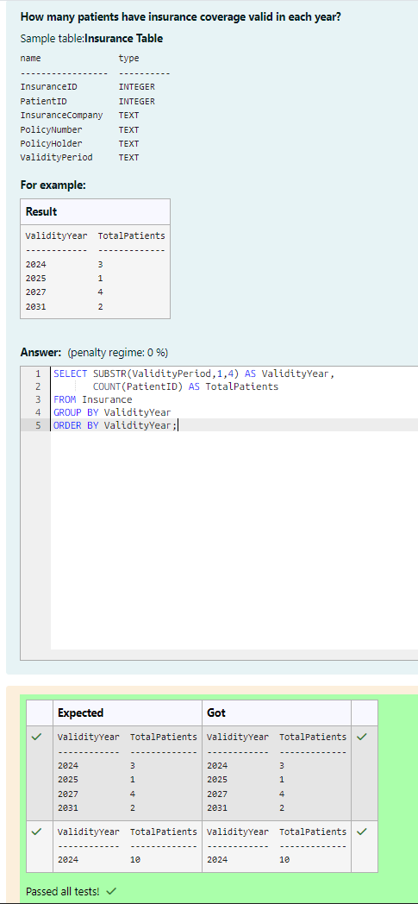
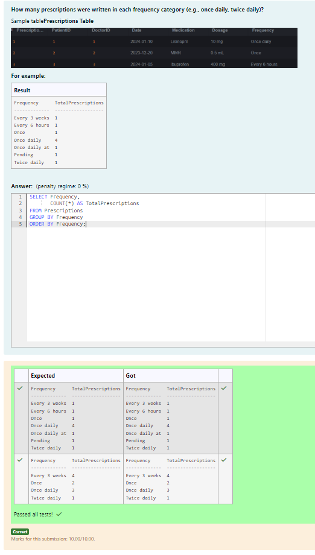
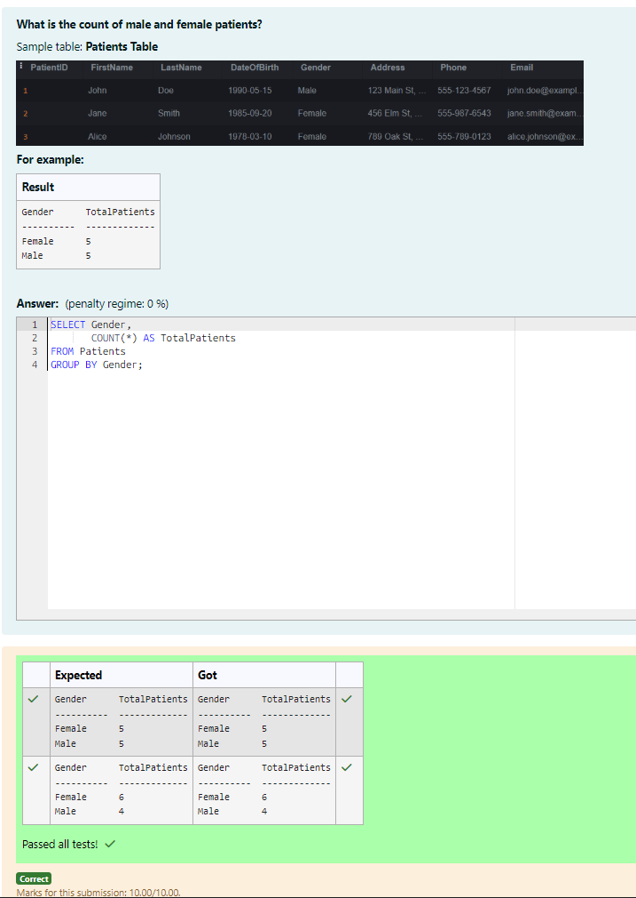
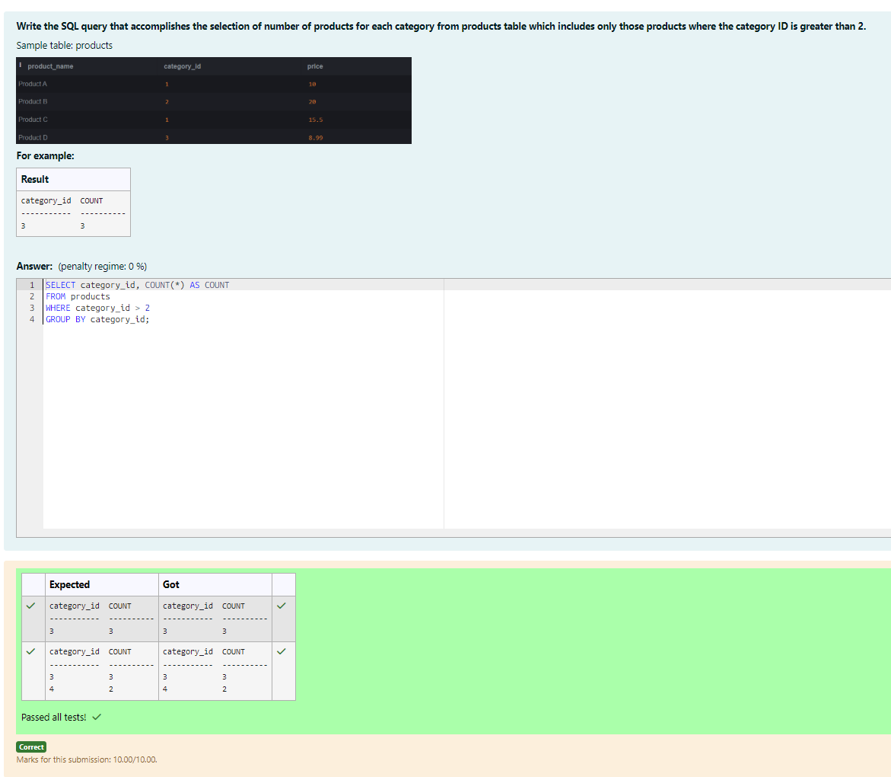
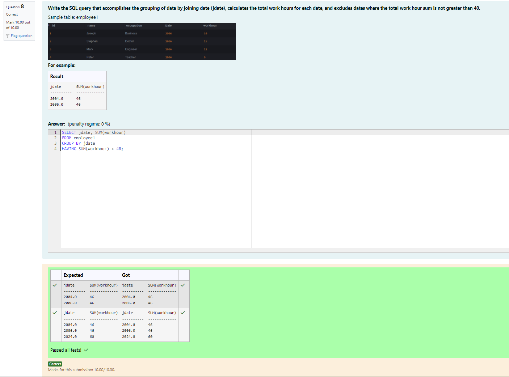
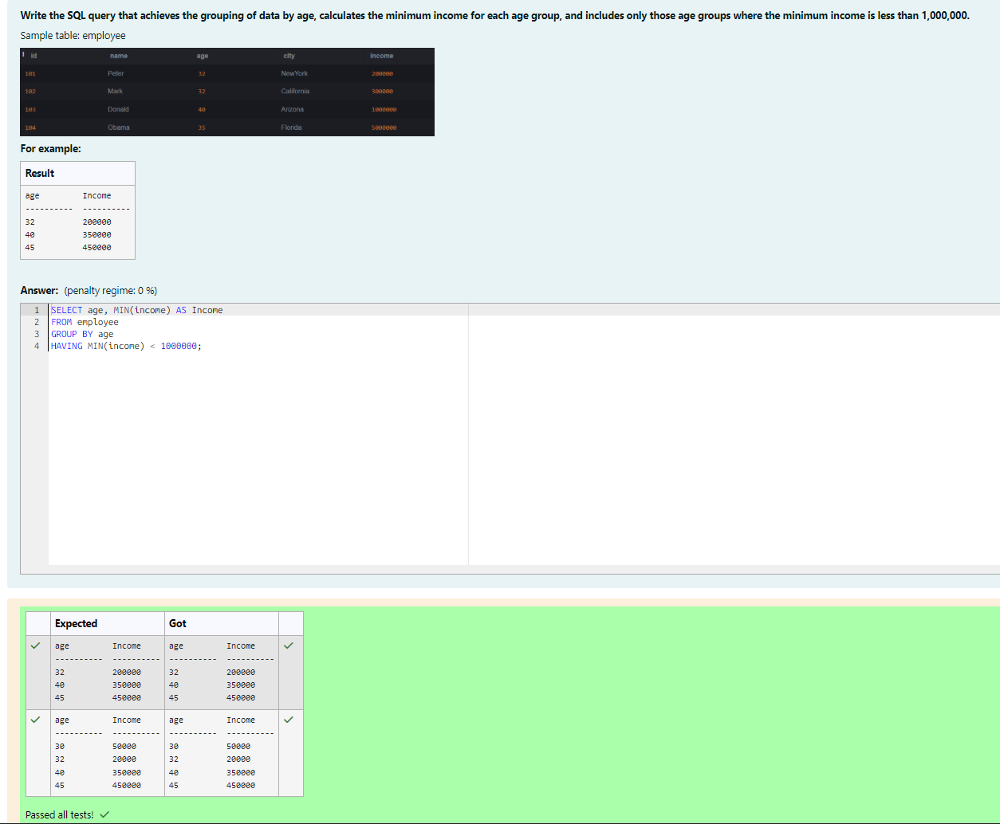
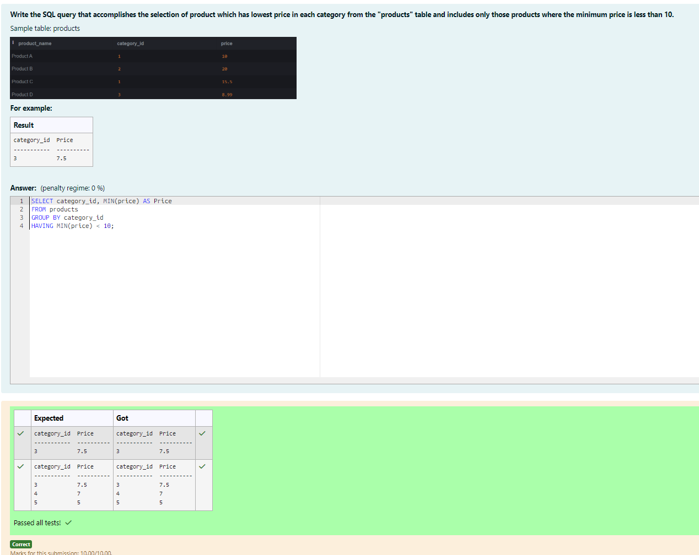

# Experiment 4: Aggregate Functions, Group By and Having Clause

## AIM
To study and implement aggregate functions, GROUP BY, and HAVING clause with suitable examples.

## THEORY

### Aggregate Functions
These perform calculations on a set of values and return a single value.

- **MIN()** – Smallest value  
- **MAX()** – Largest value  
- **COUNT()** – Number of rows  
- **SUM()** – Total of values  
- **AVG()** – Average of values

**Syntax:**
```sql
SELECT AGG_FUNC(column_name) FROM table_name WHERE condition;
```
### GROUP BY
Groups records with the same values in specified columns.
**Syntax:**
```sql
SELECT column_name, AGG_FUNC(column_name)
FROM table_name
GROUP BY column_name;
```
### HAVING
Filters the grouped records based on aggregate conditions.
**Syntax:**
```sql
SELECT column_name, AGG_FUNC(column_name)
FROM table_name
GROUP BY column_name
HAVING condition;
```

**Question 1**
--
Write a SQL query to find the average length of email addresses (in characters):
```
Table: customer

name        type
----------  ----------
id          INTEGER
name        TEXT
city        TEXT
email       TEXT
phone       INTEGER
```

```sql
SELECT AVG(LENGTH(email)) AS avg_email_length
FROM customer;
```

**Output:**



**Question 2**
---
Write a SQL query to find the youngest employee in the company?
```
Table: employee

name        type
----------  ----------
id          INTEGER
name        TEXT
age         INTEGER
city        TEXT
income      INTEGER
```

```sql
SELECT name AS Employee_Name, age AS Age
FROM employee
ORDER BY age ASC
LIMIT 1;
```

**Output:**



**Question 3**
---
Write a SQL query to calculate total purchase amount of all orders. Return total purchase amount.
```
Sample table: orders

ord_no      purch_amt   ord_date    customer_id  salesman_id

----------  ----------  ----------  -----------  -----------

70001       150.5       2012-10-05  3005         5002

70009       270.65      2012-09-10  3001         5005

70002       65.26       2012-10-05  3002         5001
```

```sql
SELECT SUM(purch_amt) AS TOTAL
FROM orders;
```

**Output:**



**Question 4**
---
How many patients have insurance coverage valid in each year?
```
Sample table:Insurance Table

name               type
-----------------  ----------
InsuranceID        INTEGER
PatientID          INTEGER
InsuranceCompany   TEXT
PolicyNumber       TEXT
PolicyHolder       TEXT
ValidityPeriod     TEXT
```

```sql
SELECT SUBSTR(ValidityPeriod,1,4) AS ValidityYear,
       COUNT(PatientID) AS TotalPatients
FROM Insurance
GROUP BY ValidityYear
ORDER BY ValidityYear;
```

**Output:**



**Question 5**
---
How many prescriptions were written in each frequency category (e.g., once daily, twice daily)?

```sql
SELECT Frequency,
       COUNT(*) AS TotalPrescriptions
FROM Prescriptions
GROUP BY Frequency
ORDER BY Frequency;
```

**Output:**



**Question 6**
---
What is the count of male and female patients?

```sql
SELECT Gender,
       COUNT(*) AS TotalPatients
FROM Patients
GROUP BY Gender;
```

**Output:**



**Question 7**
---
Write the SQL query that accomplishes the selection of number of products for each category from products table which includes only those products where the category ID is greater than 2.

```sql
SELECT category_id, COUNT(*) AS COUNT
FROM products
WHERE category_id > 2
GROUP BY category_id;
```

**Output:**



**Question 8**
---
Write the SQL query that accomplishes the grouping of data by joining date (jdate), calculates the total work hours for each date, and excludes dates where the total work hour sum is not greater than 40.

```sql
SELECT jdate, SUM(workhour)
FROM employee1
GROUP BY jdate
HAVING SUM(workhour) > 40;
```

**Output:**



**Question 9**
---
Write the SQL query that achieves the grouping of data by age, calculates the minimum income for each age group, and includes only those age groups where the minimum income is less than 1,000,000.

```sql
SELECT age, MIN(income) AS Income
FROM employee
GROUP BY age
HAVING MIN(income) < 1000000;
```

**Output:**



**Question 10**
---
Write the SQL query that accomplishes the selection of product which has lowest price in each category from the "products" table and includes only those products where the minimum price is less than 10.

```sql
SELECT category_id, MIN(price) AS Price
FROM products
GROUP BY category_id
HAVING MIN(price) < 10;
```

**Output:**



## RESULT
Thus, the SQL queries to implement aggregate functions, GROUP BY, and HAVING clause have been executed successfully.
