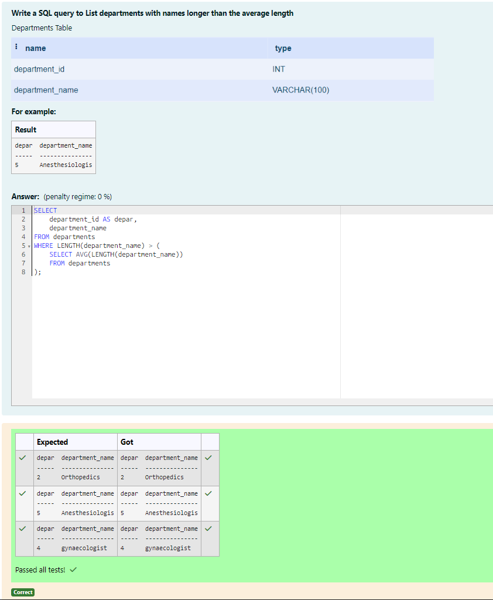
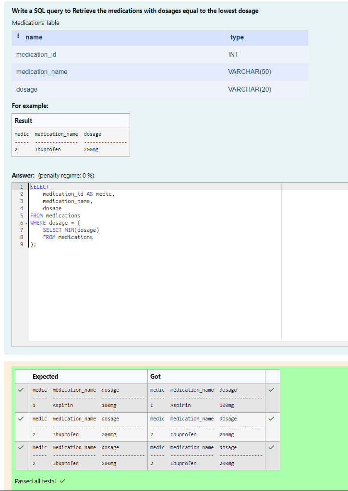
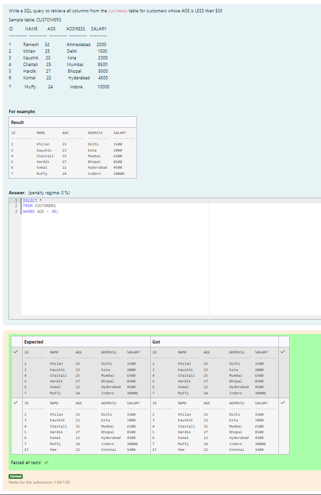
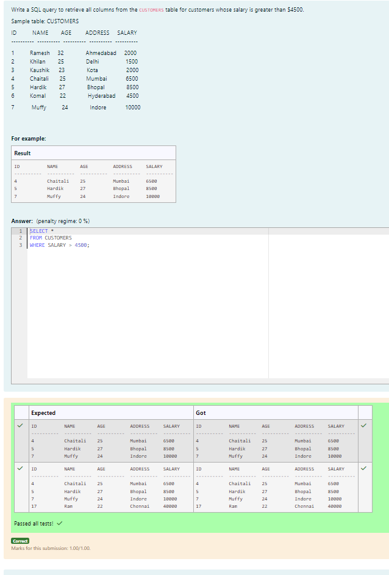
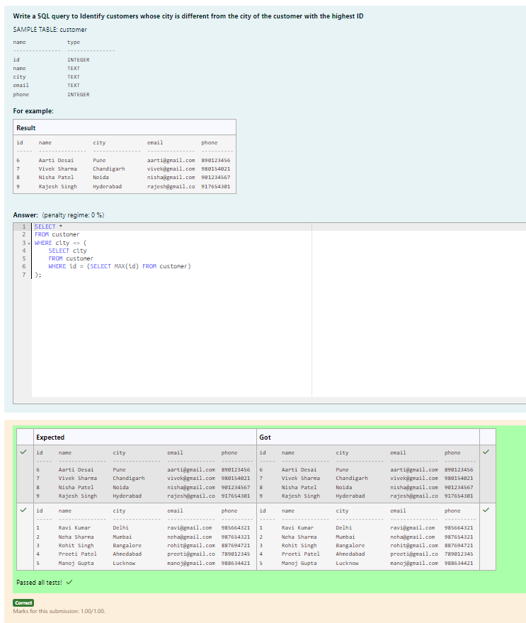
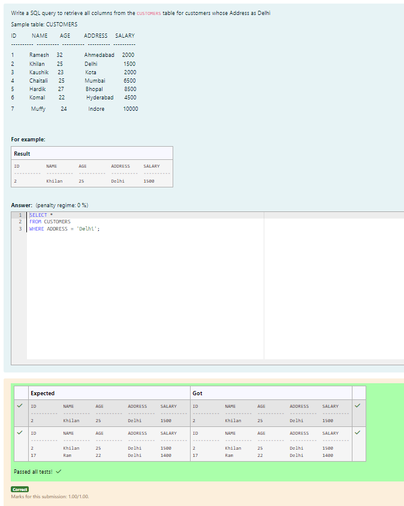
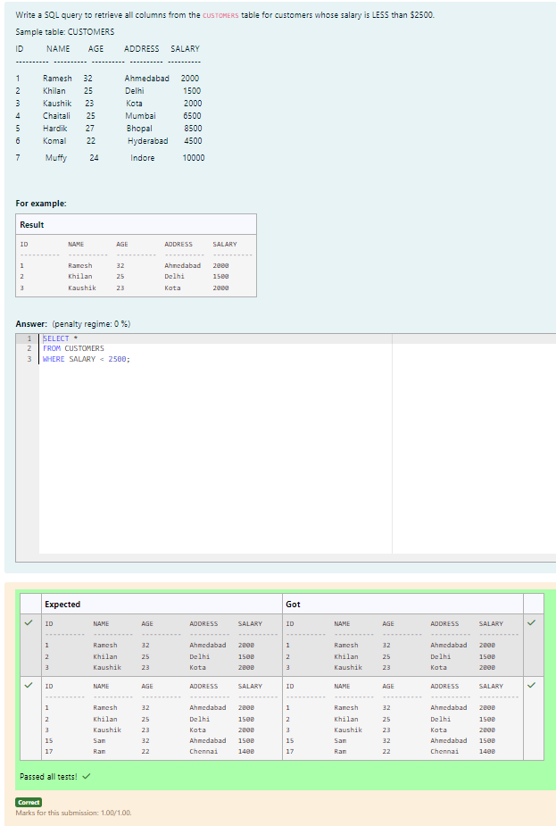
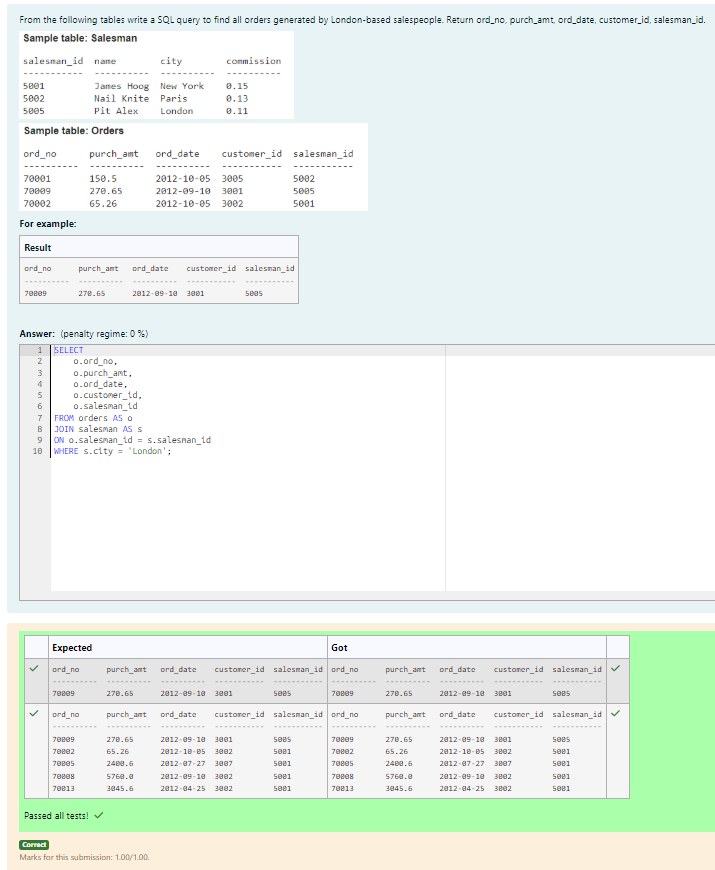
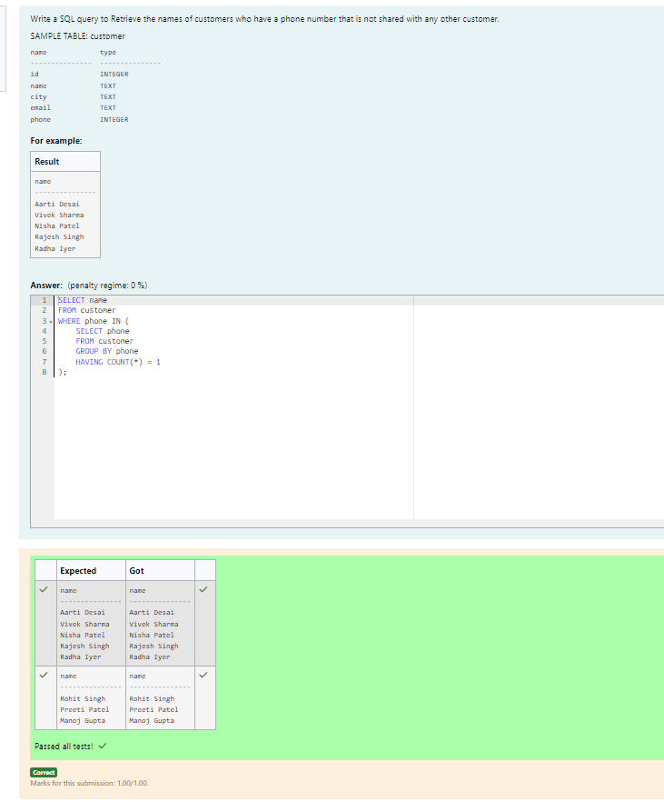
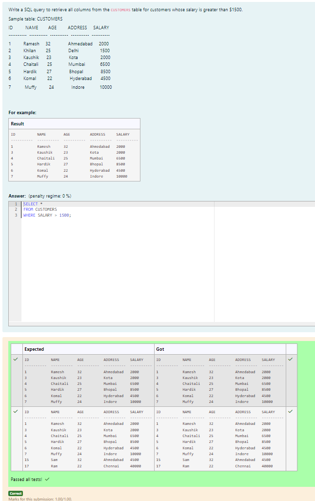

# Experiment 5: Subqueries and Views

## AIM
To study and implement subqueries and views.

## THEORY

### Subqueries
A subquery is a query inside another SQL query and is embedded in:
- WHERE clause
- HAVING clause
- FROM clause

**Types:**
- **Single-row subquery**:
  Sub queries can also return more than one value. Such results should be made use along with the operators in and any.
- **Multiple-row subquery**:
  Here more than one subquery is used. These multiple sub queries are combined by means of ‘and’ & ‘or’ keywords.
- **Correlated subquery**:
  A subquery is evaluated once for the entire parent statement whereas a correlated Sub query is evaluated once per row processed by the parent statement.

**Example:**
```sql
SELECT * FROM employees
WHERE salary > (SELECT AVG(salary) FROM employees);
```
### Views
A view is a virtual table based on the result of an SQL SELECT query.
**Create View:**
```sql
CREATE VIEW view_name AS
SELECT column1, column2 FROM table_name WHERE condition;
```
**Drop View:**
```sql
DROP VIEW view_name;
```

**Question 1**
--
Write a SQL query to List departments with names longer than the average length

```sql
SELECT 
    department_id AS depar,
    department_name
FROM departments
WHERE LENGTH(department_name) > (
    SELECT AVG(LENGTH(department_name))
    FROM departments
);
```

**Output:**



**Question 2**
---
Write a SQL query to Retrieve the medications with dosages equal to the lowest dosage

```sql
SELECT 
    medication_id AS medic,
    medication_name,
    dosage
FROM medications
WHERE dosage = (
    SELECT MIN(dosage)
    FROM medications
);
```

**Output:**



**Question 3**
---
Write a SQL query to retrieve all columns from the CUSTOMERS table for customers whose AGE is LESS than $30
```
Sample table: CUSTOMERS

ID          NAME        AGE         ADDRESS     SALARY
----------  ----------  ----------  ----------  ----------

1          Ramesh     32              Ahmedabad     2000
2          Khilan        25              Delhi                 1500
3          Kaushik      23              Kota                  2000
4          Chaitali       25             Mumbai            6500
5          Hardik        27              Bhopal              8500
6          Komal         22              Hyderabad       4500

7           Muffy          24              Indore            10000
```

```sql
SELECT *
FROM CUSTOMERS
WHERE AGE < 30;
```

**Output:**



**Question 4**
---
-- Paste Question 4 hereWrite a SQL query to retrieve all columns from the CUSTOMERS table for customers whose salary is greater than $4500.
```
Sample table: CUSTOMERS

ID          NAME        AGE         ADDRESS     SALARY
----------  ----------  ----------  ----------  ----------

1          Ramesh     32              Ahmedabad     2000
2          Khilan        25              Delhi                 1500
3          Kaushik      23              Kota                  2000
4          Chaitali       25             Mumbai            6500
5          Hardik        27              Bhopal              8500
6          Komal         22              Hyderabad       4500
7           Muffy          24              Indore            10000
```

```sql
SELECT *
FROM CUSTOMERS
WHERE SALARY > 4500;
```

**Output:**



**Question 5**
---
Write a SQL query to Identify customers whose city is different from the city of the customer with the highest ID
```
SAMPLE TABLE: customer

name             type
---------------  ---------------
id               INTEGER
name             TEXT
city             TEXT
email            TEXT
phone            INTEGER
```

```sql
SELECT *
FROM customer
WHERE city <> (
    SELECT city
    FROM customer
    WHERE id = (SELECT MAX(id) FROM customer)
);
```

**Output:**



**Question 6**
---
Write a SQL query to retrieve all columns from the CUSTOMERS table for customers whose Address as Delhi
```
Sample table: CUSTOMERS

ID          NAME        AGE         ADDRESS     SALARY
----------  ----------  ----------  ----------  ----------

1          Ramesh     32              Ahmedabad     2000
2          Khilan        25              Delhi                 1500
3          Kaushik      23              Kota                  2000
4          Chaitali       25             Mumbai            6500
5          Hardik        27              Bhopal              8500
6          Komal         22              Hyderabad       4500
7           Muffy          24              Indore            10000
```

```sql
SELECT *
FROM CUSTOMERS
WHERE ADDRESS = 'Delhi';
```

**Output:**



**Question 7**
---
Write a SQL query to retrieve all columns from the CUSTOMERS table for customers whose salary is LESS than $2500.
```
Sample table: CUSTOMERS

ID          NAME        AGE         ADDRESS     SALARY
----------  ----------  ----------  ----------  ----------

1          Ramesh     32              Ahmedabad     2000
2          Khilan        25              Delhi                 1500
3          Kaushik      23              Kota                  2000
4          Chaitali       25             Mumbai            6500
5          Hardik        27              Bhopal              8500
6          Komal         22              Hyderabad       4500
7           Muffy          24              Indore            10000
```

```sql
SELECT *
FROM CUSTOMERS
WHERE SALARY < 2500;
```

**Output:**



**Question 8**
---
From the following tables write a SQL query to find all orders generated by London-based salespeople. Return ord_no, purch_amt, ord_date, customer_id, salesman_id.

```sql
SELECT 
    o.ord_no,
    o.purch_amt,
    o.ord_date,
    o.customer_id,
    o.salesman_id
FROM orders AS o
JOIN salesman AS s
ON o.salesman_id = s.salesman_id
WHERE s.city = 'London';
```

**Output:**



**Question 9**
---
Write a SQL query to Retrieve the names of customers who have a phone number that is not shared with any other customer.
```
SAMPLE TABLE: customer

name             type
---------------  ---------------
id               INTEGER
name             TEXT
city             TEXT
email            TEXT
phone            INTEGER
```

```sql
SELECT name
FROM customer
WHERE phone IN (
    SELECT phone
    FROM customer
    GROUP BY phone
    HAVING COUNT(*) = 1
);
```

**Output:**



**Question 10**
---
Write a SQL query to retrieve all columns from the CUSTOMERS table for customers whose salary is greater than $1500.
```
Sample table: CUSTOMERS

ID          NAME        AGE         ADDRESS     SALARY
----------  ----------  ----------  ----------  ----------

1          Ramesh     32              Ahmedabad     2000
2          Khilan        25              Delhi                 1500
3          Kaushik      23              Kota                  2000
4          Chaitali       25             Mumbai            6500
5          Hardik        27              Bhopal              8500
6          Komal         22              Hyderabad       4500
7           Muffy          24              Indore            10000
```

```sql
SELECT *
FROM CUSTOMERS
WHERE SALARY > 1500;
```

**Output:**



## RESULT
Thus, the SQL queries to implement subqueries and views have been executed successfully.
